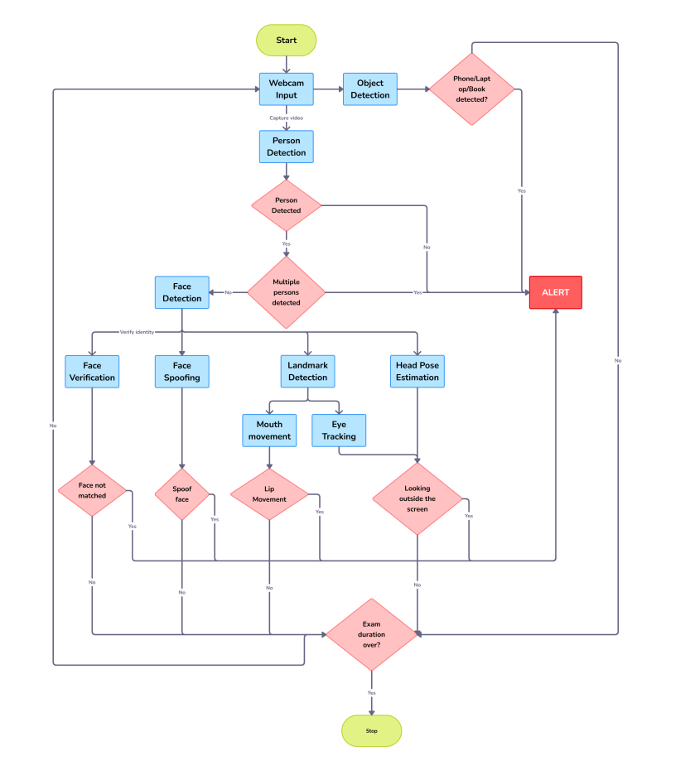
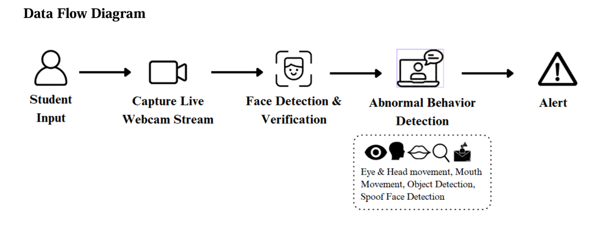
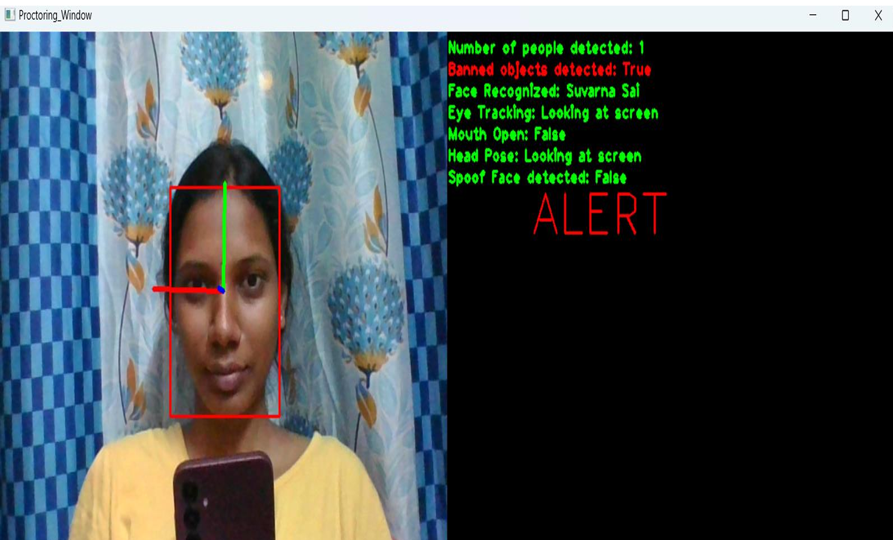

# Smart AI-based Online Proctoring System

This project is a **Smart AI-based Online Proctoring System** that leverages computer vision and deep learning to monitor and ensure the integrity of online examinations. The system detects faces, recognizes students, tracks head pose and gaze, detects banned objects, and identifies face spoofing attempts in real-time using a webcam.

---

## Table of Contents

- [Features](#features)
- [System Architecture](#system-architecture)
- [Data Flow Diagram](#data-flow-diagram)
- [Screenshot](#screenshot)
- [Setup Instructions](#setup-instructions)
- [Usage](#usage)
- [Documentation & PPT](#documentation--ppt)
- [UML Diagrams](#uml-diagrams)
- [Acknowledgements](#acknowledgements)
- [Conclusion](#conclusion)

---

## Features

- **Face Detection & Recognition:** Identifies and verifies the student using a pre-registered database.
- **Head Pose Estimation:** Detects if the student is looking away from the screen.
- **Eye Gaze Tracking:** Monitors if the student is looking at the screen.
- **Object Detection:** Detects banned objects such as mobile phones, books, laptops, and additional persons.
- **Face Spoofing Detection:** Identifies attempts to cheat using photos or videos.
- **Real-time Alerts:** Provides on-screen alerts for suspicious activities.

---

## System Architecture

The system is composed of several modules working together in real-time:

- **Input:** Webcam video stream.
- **Preprocessing:** Frame resizing and color conversion.
- **Face Detection:** Locates faces in the frame.
- **Face Recognition:** Matches detected faces with the student database.
- **Head Pose & Gaze Estimation:** Determines if the student is attentive.
- **Object Detection:** Identifies banned objects and additional persons.
- **Spoof Detection:** Checks for fake faces.
- **Alert System:** Displays warnings and logs suspicious activities.



---

## Data Flow Diagram

The data flow diagram illustrates how data moves through the system, from video capture to alert generation.



---

## Screenshot

Below is a sample screenshot of the proctoring system in action.  
For more screenshots and detailed visuals, please refer to the documentation.



---

## Setup Instructions

1. **Clone the repository:**
    ```bash
    git clone https://github.com/suvarna-pokuru/Smart-AI-Proctor.git
    cd Smart-AI-Proctor/Code
    ```

2. **Install dependencies:**
    ```bash
    pip install -r requirements.txt
    ```

3. **Download Pre-trained Models:**
    - Download the required model files (YOLOv3, face detector, head pose model, etc.) using the link in `models/link.txt`.
    - Place all downloaded models in the `models/` directory.

4. **Add Student Images:**
    - Save images of registered students in the `student_db/` directory.
    - Each image file should be named after the student (e.g., `john_doe.jpg`).

5. **Run the Proctoring System:**
    ```bash
    python online_proctoring_system.py
    ```

---

## Usage

- The webcam will activate and display a real-time monitoring interface.
- The system detects and displays alerts for:
  - Unrecognized faces
  - Multiple people on screen
  - Looking away / Head turned
  - Speaking (mouth open)
  - Spoofing (photos or video replay)
  - Banned objects (e.g., phone)
- Press `q` to exit the application.

---

## Documentation & PPT

- 📄 Full **project documentation** and an informative **PPT presentation** are available:
  - [📘 View Documentation (PDF)](https://github.com/suvarna-pokuru/Smart-AI-Proctor/blob/main/SUVARNA_Documentation%202.pdf)
  - [📊 View Project PPT (PPTX)](https://github.com/suvarna-pokuru/Smart-AI-Proctor/blob/main/23G21F0061.pptx)

These resources include:
- System design explanation
- Architectural and data flow diagrams
- Setup guidance
- UML diagrams
- Sample screenshots

---

## UML Diagrams

Included in the documentation and PPT:

- ✅ Use Case Diagram  
- ✅ Activity Diagram  
- ✅ Sequence Diagram  
- ✅ Class Diagram

> For complete diagrams, refer to the [Documentation PDF](https://github.com/suvarna-pokuru/Smart-AI-Proctor/blob/main/SUVARNA_Documentation%202.pdf) and [PPT](https://github.com/suvarna-pokuru/Smart-AI-Proctor/blob/main/23G21F0061.pptx).

---

## Acknowledgements

- [face_recognition](https://github.com/ageitgey/face_recognition)
- [YOLOv3](https://pjreddie.com/darknet/yolo/)
- [OpenCV](https://opencv.org/)
- [dlib](http://dlib.net/)

---

## Conclusion

The **Smart AI-based Online Proctoring System** presents a powerful, real-time solution for ensuring the integrity of remote examinations using artificial intelligence and computer vision. It automates the process of monitoring students during online tests by detecting suspicious behavior such as multiple faces, object presence, head movements, and face spoofing.

This project serves as a strong foundation for academic research and real-world application. With further enhancements like cloud integration, multi-user support, and detailed logging/reporting, it has the potential to evolve into a scalable, production-ready solution.

If you have any suggestions, feel free to open an issue or contribute to the repository!

---
